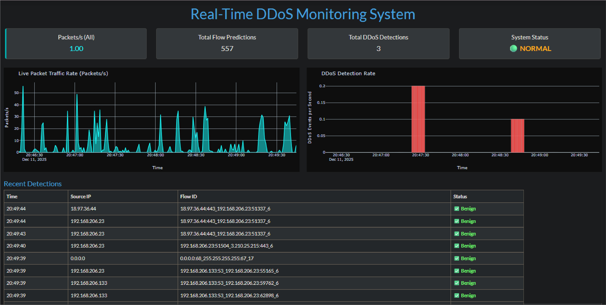

# 🛡️ Real-Time DDoS Detection Using Machine Learning  
### **Practical Network Security System Inspired by the CIC IDS 2017 Dataset (Friday Attacks + Normal Traffic)**  



---

## ⭐ Project Overview

This project demonstrates a complete, end-to-end **real-time DDoS attack detection system** powered by **Machine Learning** and deployable on real network environments.  
It captures live traffic, extracts network flow features, classifies them using trained ML models, and displays results on an interactive dashboard — all while allowing the system to be stress-tested using a Docker-based attack generator.

The goal of this project is to explore how **AI-driven techniques can strengthen network security defenses** by identifying malicious traffic patterns in real time.

---

## 📚 Dataset Reference

The ML models were trained on the **Friday Attacks + Normal Activity** subset of the well-known and widely used **CIC IDS 2017** dataset.

### Dataset Citation  
Sharafaldin, I., Lashkari, A. H., & Ghorbani, A. A. (2018).  
**Toward Generating a New Intrusion Detection Dataset and Intrusion Traffic Characterization.**  
_In Proceedings of the 4th International Conference on Information Systems Security and Privacy (ICISSP 2018)._  
Canadian Institute for Cybersecurity, University of New Brunswick.  
Dataset URL: https://www.unb.ca/cic/datasets/ids-2017.html

---

## 🎯 Key Capabilities

### ✔ Live Traffic Capture  
Monitors a Windows machine in real time, converting raw packets into flow-based features.

### ✔ Machine Learning-Based Detection  
Three ML models were trained and evaluated:

- Logistic Regression  
- MLP / Neural Network  
- **Random Forest (Best Performing)**  

Random Forest was chosen due to its exceptional balance of precision, recall, and real-world robustness.

| Model | Accuracy | Precision | Recall | F1 Score |
|-------|----------|-----------|---------|-----------|
| **Random Forest** | **0.9993** | **0.9998** | **0.9989** | **0.9993** |

### ✔ Real-Time Dashboard  
Provides:
- Live traffic graphs  
- Active flow list  
- Attack alerts  
- Detection timeline  
- Source IP   

### ✔ Docker-Based Attack Simulator  
Generates realistic DDoS traffic:
- HTTP Flood  
- SYN Flood  
- UDP Flood  
- Slowloris  
- Custom attack parameters  

This makes the system testable in real conditions without needing a second physical machine.

---

## 🧠 Features Used for ML Training

The model was trained on 77+ detailed network flow features such as:

- Flow duration  
- Total forward/backward packets  
- Packet length statistics  
- Inter-arrival times (IAT)  
- Header flags (SYN, ACK, RST, PSH, URG)  
- Bytes per second, packets per second  
- Active/Idle times  
- Segment sizes  
- Window sizes  
- Subflow statistics  

Working with these features strengthened my understanding of how **low-level packet behavior reflects high-level network attack patterns**.

---

## ⚙️ System Architecture

```

┌────────────────────────────-┐
│     Docker Attack Box       │
│  (HTTP, SYN, UDP, Slowloris)│
└──────────────┬─────────────-┘
│
▼
┌────────────────────────────────────┐
│   Windows 11 Host Detection Node   │
│  • Live packet capture             │
│  • ML model prediction engine      │
│  • Real-time dashboard             │
└────────────────────────────────────┘

````

---

## 🚀 How to Run This Project

### **1️⃣ Clone Repository**
```bash
git clone https://github.com/Salmanbnr/DDoS_ML.git
cd DDoS_ML
````

### **2️⃣ Create & Activate Virtual Environment**

```bash
python -m venv venv
venv\Scripts\activate
```

### **3️⃣ Install Dependencies**

```bash
pip install -r requirements.txt
```

### **4️⃣ Start the Detection Dashboard**

```bash
python dashboard.py
```

Dashboard available at:
👉 **[http://127.0.0.1:8050](http://127.0.0.1:8050)**

---

## 🧪 Running the Docker Attack Simulator

Open a second terminal:

```bash
cd DockerAttackSimulator
```

### **Build the Docker Image**

```bash
docker build -t ddos-attacker .
```

### **Run an Attack**

Example — HTTP Flood Attack:

```bash
docker run --rm -it ddos-attacker python3 docker_ddos_attacker.py \
    --target YOUR_WINDOWS_IP \
    --port 8050 \
    --type http \
    --duration 120 \
    --intensity medium
```
#### **Run an Attack way 2**

The another way to run attack is to run

```bash
run_docker_attack.bat
```

Traffic immediately shows up in the dashboard.

---

## 🎓 What This Project Demonstrates

Through this project, I gained hands-on experience in:

### 🔹 Network Engineering

Understanding flow structures, TCP/UDP behavior, and interpreting low-level packet attributes.

### 🔹 Machine Learning for Security

Feature engineering, model training, validation, optimization, and handling real-time predictions.

### 🔹 Real-World System Deployment

* Live monitoring
* Docker-based attack simulation
* Integrating ML into operational environments
* Building end-to-end security pipelines

The project serves as a practical example of applying advanced ML techniques to real cybersecurity challenges.

---

## 🧭 Future Directions

Planned upgrades include:

* Deep Learning models (LSTM, Transformer-based IDS)
* Autoencoder-based anomaly detection
* Detection of multi-vector attacks
* Cloud or distributed deployment
* Adaptive / online learning from real traffic

---

## 🔒 Ethical Use

This project is intended **only for:**

* Research
* Education
* Testing on personal systems
* Network defense experiments

It must **never** be used to target external systems or networks.

---

## 🙏 Acknowledgments

* Canadian Institute for Cybersecurity (UNB) for the CIC IDS 2017 dataset
* Open-source ML libraries (Scikit-learn, Pandas, NumPy)
* Community tools that support research in cybersecurity

---